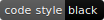

# Certgrinder server: certgrinderd

This is the server part of the [Certgrinder project](https://certgrinder.readthedocs.io/en/latest/introduction.html). The package is called ``certgrinderd``. It can be installed [from pypi](https://pypi.org/project/certgrinderd/).

It is meant to be used with the [certgrinder](https://pypi.org/project/certgrinder/) client package.

Documentation can be found at ReadTheDocs: https://certgrinder.readthedocs.io/en/latest/certgrinderd.html
